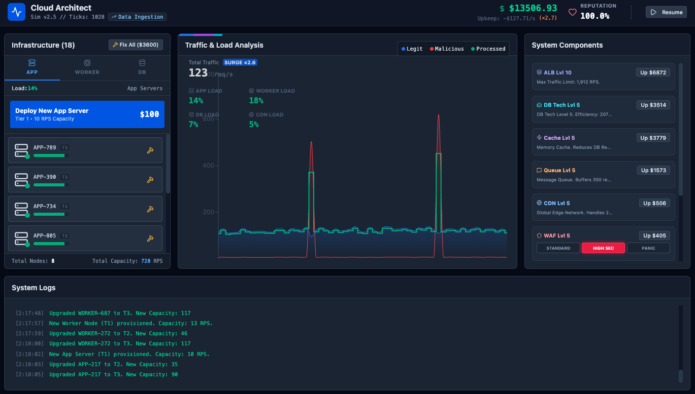

# Cloud Architect (Cloud Server Simulator)

A real-time infrastructure management sim where you scale a cloud architecture under rising traffic, shifting workloads, and security incidents. Keep **reputation** high, stay **profitable**, and prevent your system from collapsing.



## Game loop

Every second (a “tick”), the simulator:

- **Generates traffic** based on growth + randomness
- **Applies a traffic pattern** (Normal Flow / Shopping Spree / Data Ingestion / Viral Content)
- **Injects attacks/events** occasionally (botnet DDoS, viral spikes, cooling failure, fiber cut, investor funding)
- **Routes requests through your stack** (ALB → WAF → CDN → App/Worker/DB)
- **Computes throughput, drops, and health decay**
- **Updates economics** (revenue vs upkeep) and **reputation** based on success + security outcomes

Your job is to continuously invest in capacity and efficiency while keeping operating costs (upkeep) under control.

## What you can build / upgrade

### Nodes (horizontal scaling)

Provision and upgrade nodes across three layers:

- **APP**: handles general request processing
- **WORKER**: handles heavy compute (uploads, writes)
- **DB**: handles reads/writes/search (more expensive; critical bottleneck)

Each node has:

- **Tier**: T1 → T2 → T3 (higher capacity, higher upkeep)
- **Health**: decays faster when overloaded; can crash and require repair/reboot

### Components (platform scaling)

- **ALB (Load Balancer)**: hard caps max incoming request rate
- **WAF (Firewall)**: blocks malicious traffic; can overload under extreme load
- **CDN**: serves static traffic; overflow falls back to app servers
- **DB Tech**: multiplies effective DB capacity (efficiency)
- **Cache (Redis)**: reduces DB read/search demand
- **Queue (SQS)**: buffers bursts for write/upload workloads

## Operations (one-click “tasks”)

Timed boosts with cooldowns:

- **Flush CDN Cache**: temporary CDN capacity boost
- **Optimize Indexes**: temporary DB efficiency boost
- **Live Security Patch**: temporary WAF boost

## Security modes

Switch WAF behavior:

- **Standard**: baseline filtering, no false positives
- **High Sec**: better blocking, small false positive rate (may drop legit requests)
- **Panic**: strongest blocking, high false positive rate

## Win / lose conditions

There’s no “win screen” — the challenge is how long you can survive as traffic scales.

You **lose** when either:

- **Reputation hits 0%**
- **Budget falls too far into the red** (bankruptcy threshold)

## Tips

- **Upgrade ALB early**: it’s a hard cap; if you hit it you’ll drop traffic immediately.
- **Watch the bottleneck**: DB overload cascades into drops and reputation loss.
- **Use cache + DB tech** to tame read/search-heavy patterns.
- **Use queue + workers** for write/upload-heavy patterns.
- **Avoid running hot**: overload accelerates node health decay and can cause crashes.

## Tech stack

- React 19 + TypeScript
- Vite
- Tailwind CSS v4
- Recharts (traffic chart)
- Lucide (icons)

## Running locally (bun)

```bash
bun install
bun run dev
```

Then open the URL printed by Vite (usually `http://localhost:5173`).

### Production build

```bash
bun run build
bun run preview
```

## Formatting / linting

```bash
bun run format
bun run lint
```
